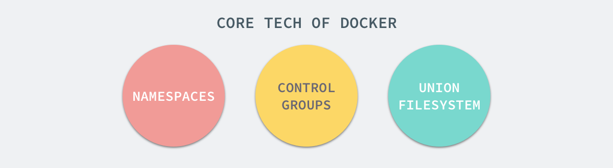

# Docker

## 1. 背景
在日常的实际开发，我们可能会遇上以下一系列的问题。
* 同一份代码或同一个可执行程序，在不同的机器下运行出不一样的结果。
* 多个服务同时部署在同一台机器下，但各服务要求对系统或环境的设置各不相同。
* 当生产环境出现故障时，只有在生产环境上最容易定位问题。
* 多个程序同时部署在同一台机器下，一个有性能问题的程序占用了所有的物理资源，导致另一程序无法正常运行。
* 当攻击者对程序漏洞进行攻击时（如get shell），会直接危害到整台机器的安全。

简而言之，Docker可以说是一个平台或者一个工具，为一个软件从开发到发布的流程提供了一致性。
用于消除配置环境差异带来的软件开发成本，因为其发布实质上是将环境与代码一起发布。
此外，还能使多个应用程序可以在相互隔离的容器中互不干扰地运行。

## 2. 核心原理
Docker-CE 目前版本组件丰富，功能复杂，本章不过多讨论。
只讨论其虚拟化的实现是通过哪些核心技术来支撑的。

### 2.1 Linux Namespace
Linux Namespace是Linux提供的一种内核级别环境隔离的方法。
从Linux 3.8开始，非特权进程可以创建用户命名空间，在这些命名空间中它们拥有完全权限，以及拥有在该命名空间下创建子空间的权限。

Linux Namespace 有如下种类：

|分类	|系统调用参数	|相关内核版本|
|-------|-------|-------------------|
|Mount namespaces	|CLONE_NEWNS	|Linux 2.4.19|
|UTS namespaces	|CLONE_NEWUTS	|Linux 2.6.19|
|IPC namespaces	|CLONE_NEWIPC	|Linux 2.6.19|
|PID namespaces	|CLONE_NEWPID	|Linux 2.6.24|
|Network namespaces	|CLONE_NEWNET	|始于Linux 2.6.24 完成于 Linux 2.6.29|
|User namespaces	|CLONE_NEWUSER	|始于 Linux 2.6.23 完成于 Linux 3.8|

要使用Linux Namespace, 主要通过调用以下3个内核API：
* clone() – 实现线程的系统调用，用来创建一个新的进程，并可以通过设计上述参数达到隔离
* unshare() – 使某进程脱离某个namespace
* setns() – 把某进程加入到某个namespace

                       
#### 2.1.1 Mount namespaces（CLONE_NEWNS，Linux 2.4.19）
隔离一组进程的文件系统挂载点集。因此，不同命名空间中的进程所见的文件系统可能有所不同。
若某进程加入到某mount命名空间时，系统调用mount() 和umount() 将不再修改整改个系统的文件系统挂载点集，而是仅修改与调用进程关联的Mount namespaces。

Mount namespaces的能用于创建一个类似于chroot jails的环境。但是，Mount namespaces更安全，更灵活。
例如，命名空间可以形成父子关系，以便事件及规则可以自动从一个命名空间继承到另一个命名空间; 例如，这允许挂载在父级命名空间中的光盘设备自动出现在子命名空间中。

#### 2.1.2 UTS namespaces（CLONE_NEWUTS，Linux 2.6.19）
隔离两个系统标识符 - nodename和 domainname, 在不同的 UTS namespaces下调用uname()系统接口，可以得到不同的接口; 
还能通过使用sethostname()和 setdomainname()系统调用设置当前UTS namespaces的名称。
这对于基于这些名称定制其操作的初始化和配置脚本非常有用。

#### 2.1.3 IPC namespaces（CLONE_NEWIPC，Linux 2.6.19）
隔离了某些进程间通信的（IPC）资源，即System V IPC对象和POSIX消息队列。
这些IPC机制的共同特征是IPC对象由文件系统路径名以外的机制识别。
每个IPC namespaces都有自己的一组System V IPC标识符和自己的POSIX消息队列文件系统。

#### 2.1.4 PID namespaces（CLONE_NEWPID，Linux 2.6.24）
用于隔离进程ID。换言之，不同PID namespaces中的进程允许出现相同的PID。
PID namespaces的主要优点之一是容器在宿主机之间迁移后，仍可为容器内的进程保留相同的进程ID。
PID namespaces还允许每个容器具有自己的 init（PID 1），即管理各种系统初始化任务的“所有进程的祖先”，并在终止时回收孤立的子进程。

从宿主机的角度来看，进程有两个PID：名称空间内的PID，以及主机系统上名称空间外的PID。
PID namespaces可以嵌套：PID namespace 下还能重复创建 namespace

#### 2.1.5 Network namespaces （CLONE_NEWNET，在Linux 2.4.19 2.6.24中启动，主要由Linux 2.6.29完成）
隔离与网络相关的系统资源的资源。因此，每个Network namespace都有自己的网络设备，IP地址，IP路由表，/proc/net 目录，端口号等。

Network namespace从网络角度使容器拥有更高的可用性：每个容器可以拥有自己的（虚拟）网络设备和自己的应用程序，这些应用程序绑定到每个命名空间的端口号空间; 
再在宿主机中再配置合适的路由规则将转到与特定容器相关联的网络设备。例如，可以在同一主机系统上具有多个容器化Web服务器，每个服务器在其（每个容器）Network namespace中绑定端口80。

#### 2.1.6 User namespaces （CLONE_NEWUSER，在Linux 2.6.23中启动，在Linux 3.8中完成）
隔离用户和组ID号。换言之，进程的用户和组ID在User namespace的内部和外部可以是不同的。
此外，在命名空间内拥有管理员权限的进程，在User namespace外可能是由非管理员用户创建。
这意味着该进程对User namespace内的操作具有完全root权限，但对于命名空间外的操作没有管理员权限。

#### 2.1.7 命名空间使用Demo：执行一个在指定命名空间下的bash
TODO: demo代码编写及执行

### 2.2 CGroups
Linux CGroup全称Linux Control Group， 是Linux内核的一个功能，用来限制，控制与分离一个进程组群的资源（如CPU、内存、磁盘输入输出等）。
这个项目最早是由Google的工程师在2006年发起（主要是Paul Menage和Rohit Seth），最早的名称为进程容器（process containers）。
在2007年时，因为在Linux内核中，容器（container）这个名词太过广泛，为避免混乱，被重命名为cgroup，并且被合并到2.6.24版的内核中去。

主要提供了如下功能：
* Resource limitation: 限制资源使用，比如内存使用上限以及文件系统的缓存限制。
* Prioritization: 优先级控制，比如：CPU利用和磁盘IO吞吐。
* Accounting: 一些审计或一些统计，可用于统计特定进程对硬件资源的使用然后进行计费。
* Control: 挂起进程，恢复执行进程。
  
#### 2.2.1 CGroup的术语
* 任务（Tasks）：就是系统的一个进程。
* 控制组（Control Group）：一组按照某种标准划分的进程.
* 层级（Hierarchy）：控制组是可以具有继承关系的。简单点说，hierarchy就是在一个或多个子系统上的cgroups目录树。
* 子系统（Subsystem）：一个子系统就是一个资源控制器，比如CPU子系统就是控制CPU时间分配的一个控制器。子系统必须附加到一个层级上才能起作用。

#### 2.2.2 CGroup的子系统
Linux Control Group 可以限制进程以下几类子系统对资源的使用:
* blkio — 这​​​个​​​子​​​系​​​统​​​为​​​块​​​设​​​备​​​设​​​定​​​输​​​入​​​/输​​​出​​​限​​​制​​​，比​​​如​​​物​​​理​​​设​​​备​​​（磁​​​盘​​​，固​​​态​​​硬​​​盘​​​，USB 等​​​等​​​）。
* cpu — 这​​​个​​​子​​​系​​​统​​​使​​​用​​​调​​​度​​​程​​​序​​​提​​​供​​​对​​​ CPU 的​​​ cgroup 任​​​务​​​访​​​问​​​。​​​
* cpuacct — 这​​​个​​​子​​​系​​​统​​​自​​​动​​​生​​​成​​​ cgroup 中​​​任​​​务​​​所​​​使​​​用​​​的​​​ CPU 报​​​告​​​。​​​
* cpuset — 这​​​个​​​子​​​系​​​统​​​为​​​ cgroup 中​​​的​​​任​​​务​​​分​​​配​​​独​​​立​​​ CPU（在​​​多​​​核​​​系​​​统​​​）和​​​内​​​存​​​节​​​点​​​。
* devices — 这​​​个​​​子​​​系​​​统​​​可​​​允​​​许​​​或​​​者​​​拒​​​绝​​​ cgroup 中​​​的​​​任​​​务​​​访​​​问​​​设​​​备​​​。​​​
* freezer — 这​​​个​​​子​​​系​​​统​​​挂​​​起​​​或​​​者​​​恢​​​复​​​ cgroup 中​​​的​​​任​​​务​​​。​​​
* memory — 这​​​个​​​子​​​系​​​统​​​设​​​定​​​ cgroup 中​​​任​​​务​​​使​​​用​​​的​​​内​​​存​​​限​​​制​​​，并​​​自​​​动​​​生​​​成​​​​​内​​​存​​​资​​​源使用​​​报​​​告​​​。
* net_cls — 这​​​个​​​子​​​系​​​统​​​使​​​用​​​等​​​级​​​识​​​别​​​符​​​（classid）标​​​记​​​网​​​络​​​数​​​据​​​包​​​，可​​​允​​​许​​​ Linux 流​​​量​​​控​​​制​​​程​​​序​​​（tc）识​​​别​​​从​​​具​​​体​​​ cgroup 中​​​生​​​成​​​的​​​数​​​据​​​包​​​。​​​
* net_prio — 这个子系统用来设计网络流量的优先级。
* hugetlb — 这个子系统主要针对于HugeTLB系统进行限制，这是一个大页文件系统。

[CGroup 官方文档](https://www.kernel.org/doc/html/latest/admin-guide/cgroup-v2.html)

#### 2.2.2 CGroups Demo: 限制进程的资源使用
TODO: 限制一个死循环进程对cpu的使用

### 2.3 Union Filesystem
Union Filesystem 千千万，我们就只讲docker优先使用overlay2好了。

### 2.4 简单总结
Linux Namespace: 用于实现操作系统级别资源的隔离，如主机名、域名、PID、文件系统等。

CGroups: 物理资源的隔离, 如CPU、硬盘、内存等。

Union Filesystem: 镜像文件的合并。

## 3. Docker架构
https://docs.docker.com/engine/docker-overview/

## 4. 极简使用指南

## 5. 与其他虚拟化技术的比较

## Reference
* Docker核心技术 https://draveness.me/docker
* Docker official documentation https://docs.docker.com
* Docker容器与容器云，浙江大学SEL实验室著
* DOCKER基础技术：LINUX CGROUP https://coolshell.cn/articles/17049.html
* Linux Kernel documentation https://www.kernel.org/doc/html/latest/