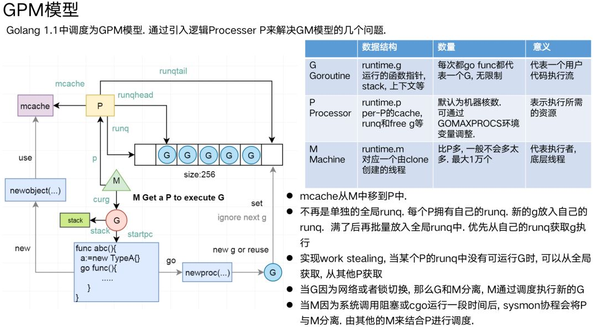

# goroutine 学习笔记

## 1. 什么是 goroutine
* goroutine是协程在go语言中的官方原生实现，由关键词`go`描述
* 使用简单, `go func1()`
* 类似操作系统对线程的调度，会被执行或阻塞，但会有以下几个异同之处之处
  * 线程的调度切换是内核态中完成的，而goroutine的调度是在用户态(golang runtime)中完成的
  * 为了能恢复到阻塞前的执行现场，两者的上下文（SP栈指针, PC程序计数器）都需要被记录下来

## 2. goroutine 结构体中的关键成员及其简析
```
type g struct {
	// 该协程的栈空间 stack中包含低位和高位[stack.lo, stack.hi)
    // 见下方
	stack       stack

    // panic 指针
	_panic       *_panic 
    // defer链表，在协程退出或崩溃时执行
	_defer       *_defer 
    // 对应一个os线程，用于执行当前goroutine
	m            *m      
    // 本协程上下文（SP栈指针, PC程序计数器）
    // 见下方
	sched        gobuf
	// 协程ID
	goid         int64

    ...
}

type stack struct {
    // 低位地址
	lo uintptr
    // 高位地址
	hi uintptr
}

type gobuf struct {
    // 栈指针
	sp   uintptr
    // 程序计数器
	pc   uintptr
}
```

## 3. GMP模型(goroutine 是如何被调度的)

