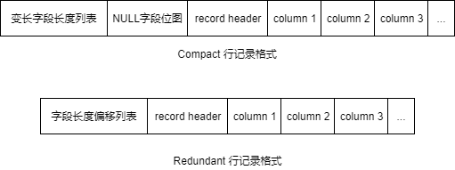

# innoDB存储引擎 表

## 1. 索引组织表
* 在innoDB中，表是根据主键顺序组织存放的
* 当没有显式定义主键时，会选用非空唯一索引作为主键
* 当不存在唯一非空索引时，innoDB存储引擎会自动创建一个6字节大小的主键。

## 2. innoDB逻辑存储结构
表空间可以看做是InnoDB存储引擎逻辑结构的最高层，所有的数据都是存放在表空间中。默认情况下InnoDB存储引擎有一个共享表空间ibdata1，即所有数据都放在这个表空间内。如果我们启用了参数innodb_file_per_table，则每张表内的数据可以单独放到一个表空间内。

对于启用了innodb_file_per_table的参数选项，需要注意的是，每张表的表空间内存放的只是数据、索引和插入缓冲，其他类的数据，如撤销（Undo）信息、系统事务信息、二次写缓冲（double write buffer）等还是存放在原来的共享表空间内。


### 2.1 段（segment）
* 数据段：B+树叶子节点
* 索引段：B+树非叶子节点
* 回滚段：事务未提交前，记录undo log, 用户执行失败时的rollback

### 2.2 区（Extend）
* 大小为1M，不可修改
* 默认情况下，一个区有64个页（大小16K，可以修改）
* 新建表时，只会分配32个碎片页，以节约磁盘空间，当32页用完后，才会申请连续页空间用于表示区

### 2.3 页（page）
* 页是innoDB管理磁盘的最小单位，默认大小为16K，可以修改。
* 页有以下类型：数据页，Undo页，系统页，事务数据页，插入缓冲位图页，插入缓冲空闲列表页，未压缩的二进制大对象页，压缩的二进制大对象页。TODO: 各种类型页的介绍

### 2.4 行（row）
* innoDB 是面向行（row-oriented）的存储引擎，即数据是按行存储的。

## 3. innoDB 行记录格式

* compact格式：通过字段长度偏移列表定位每一列数据，每行中可能存有较多未使用的空间。
  * 字段变长列表：存储每个变长字段的实际存储数据的大小
  * Null字段位图：以位图存储该行中，哪几列数据为NULL

* redundant格式：记录变长字段，并对该字段进行压缩；对Null字段进行标记。通过上述手段节约磁盘存储空间。
  * 字段长度偏移列表：记录该行中每个列的地址偏移值

## 4. innoDB 数据页结构

* File Header：表示文件头，占固定的38字节。
* Page Header：表示页里的一些状态信息，占固定的56个字节。
* Infimum + Supremum：两个虚拟的伪记录，分别表示页中的最小和最大记录，占固定的26个字节。
* User Records：真实存储记录的部分，大小不固定，格式如上一节中介绍。
* Free Space：页中尚未使用的部分，大小不确定。
* Page Directory：页中的记录相对位置，也就是各个槽在页面中的地址偏移量，大小不固定，插入的记录越多，这个部分占用的空间越多。
* File Trailer：用于检验页是否完整的部分，占用固定的8个字节。

## 5. 分区表
分区的过程是将一个表或索引分解为多个更小、更可管理的部分。

mysql仅支持水平分区及局部分区(即数据及其对应的索引均放在同一对象中)

* Range分区： 基于一个给定连续区间的列值进行分区。
```
CREATE TABLE tb_range_partition(
    id INT auto_increment,
    createdate DATETIME,
    primary key (id,createdate)
) 
PARTITION BY RANGE (TO_DAYS(createdate) ) (
   PARTITION p201801 VALUES LESS THAN ( TO_DAYS('20180201') ),
   PARTITION p201802 VALUES LESS THAN ( TO_DAYS('20180301') ),
   PARTITION p201803 VALUES LESS THAN ( TO_DAYS('20180401') )
);
```
* List分区：根据离散的值进行分区。
```
create table tb_list_partiotion
(
    id int auto_increment,
    data_type tinyint,
    primary key(id,data_type)
)partition by list(data_type)
(
    partition p0 values in (0,1,2,3,4,5,6),
    partition p1 values in (7,8,9,10,11,12),
    partition p2 values in (13,14,15,16,17)
);
```
* Hash分区：根据用户自定义表达式的返回值进行分区。
```
drop table test_hash_partiotion;
create table test_hash_partiotion
(
    id int auto_increment,
    create_date datetime,
    primary key(id,create_date)
)partition by hash(year(create_date)) partitions 10;
```
* Key分区：根据Mysql数据库提供的哈希函数来进行分区。
```
create table test_key_partiotion
(
    id int auto_increment,
    create_date datetime,
    primary key(id,create_date)
)partition by key(create_date) partitions 10;
```