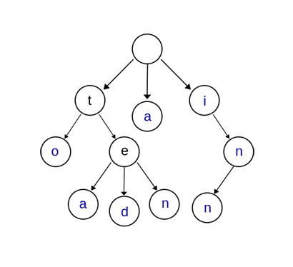

## Trie Tree 简介
--------------------------------------------
</br>
<pre>
   在计算机科学中，trie，又称前缀树或字典树，是一种有序树，用于保存关联数组，其中的键通常是字符串。
   与二叉查找树不同，键不是直接保存在节点中，而是由节点在树中的位置决定。
   一个节点的所有子孙都有相同的前缀，也就是这个节点对应的字符串，而根节点对应空字符串。
   一般情况下，不是所有的节点都有对应的值，只有叶子节点和部分内部节点所对应的键才有相关的值。
</pre>
</br>
</br>

## Trie Tree 性质及基本操作
---------------------------------------------------
<div align=center></div>
<center>pic 1. Trie Tree</center>
</br>

### 性质

<pre>
如图1 Trie Tree所示(为方便阐述该数据结构性质，该树仅存储ASCI字符，实质上，UTF-8、UTF-16甚至前缀字符串均可存储)。
该树包含关键字集合{“a”, “to”, “tea”, “ted”, “ten”, “i”, “in”, “inn”} 。从上图可以归纳出Trie树的基本性质：

1、根节点不包含字符，除根节点外的每一个子节点都包含一个字符。
从根节点到某一个节点，路径上经过的字符连接起来，为该节点对应的字符串。
2、每个节点的所有子节点包含的字符互不相同。
3、叶子节点为空，标记该前缀词结束。通常在实现的时候，会在节点结构中设置一个标志，用来标记该结点处是否构成一个单词（关键字）。

可以看出，Trie树的关键字一般都是字符串，而且Trie树把每个关键字保存在一条路径上，而不是一个结点中。
另外，两个有公共前缀的关键字，在Trie树中前缀部分的路径相同，所以Trie树又叫做前缀树（Prefix Tree）
</pre>

### 数据结构(Go实现)
```
// Trie Tree
type Trie struct {
	Root           *Node
	Mutex          sync.RWMutex
	CheckProofreadingList bool // 是否检查防错误匹配名单
}

// Node Trie tree node
type Node struct {
	Node map[rune]*Node
	End  bool
}
```
<pre>
对应上段落的性质介绍，以及数据结构定义，Trie Tree根节点不包含任何前缀字符；
叶节点为空标记该词结束(我们的实现是用一个bool类型变量标记该指针为空指针)；
每个节点的所有子节点包含的字符互不相同，Go语言Build-in类型hash map已经确保该性质。
</pre>

### 基本操作及原理
<pre>
1.插入过程
对于一个单词，从根开始，沿着单词的各个字母所对应的树中的节点分支向下走，直到单词遍历完，将最后的节点标记为红色，表示该单词已插入Trie树。

2.查询过程
同样的，从根开始按照单词的字母顺序向下遍历trie树，一旦发现某个节点标记不存在或者单词遍历完成而最后的节点未标记为红色，则表示该单词不存在，若最后的节点标记为红色，表示该单词存在。

时间复杂度均为O(M)
M为待插入/查询的字符串的长度
</pre>

```
// Trie Tree 查找
func (t *Trie) Query(text string) (bool, []string, string) {
	found := []string{}
	chars := []rune(text)
	l := len(chars)
	if l == 0 {
		return false, found, text
	}

	var (
		i, j, jj int
		ok       bool
	)

	node := t.Root
	for i = 0; i < l; i++ {
		if _, ok = node.Node[chars[i]]; !ok {
			continue
		}

		jj = 0

		node = node.Node[chars[i]]
		for j = i + 1; j < l; j++ {
			if _, ok = node.Node[chars[j]]; !ok {
				if jj > 0 {
					if t.CheckProofreadingList && t.isInProofreadingList(found, chars, i, jj, l) {
						i = jj
					} else {
						i = jj
					}
				}
				break
			}

			node = node.Node[chars[j]]
			if node.End {
				jj = j 

				if len(node.Node) == 0 || j+1 == l { 
                    // 是最后节点或者最后一个字符, break
					if t.CheckProofreadingList && t.isInProofreadingList(found, chars, i, j, l) {
						i = j
						break

					} else {
						i = j
						break
					}
				}
			}
		}
		node = t.Root
	}

	exist := false
	if len(found) > 0 {
		exist = true
	}

	return exist, found, string(chars)
}
```

## Trie树的优缺点
-----------------------------------------
Trie树的核心思想是空间换时间，利用字符串的公共前缀来减少无谓的字符串比较以达到提高查询效率的目的。
</bre>

### 优点
<pre>
1.插入和查询的效率很高，都为O(m)，其中 m 是待插入/查询的字符串的长度。

2.Trie树中不同的关键字不会产生冲突。

3.Trie树只有在允许一个关键字关联多个值的情况下才有类似hash碰撞发生。

4.Trie树不用求 hash 值，对短字符串有更快的速度。通常，求hash值也是需要遍历字符串的。

5.Trie树可以对关键字按字典序排序
</pre>

### 缺点
<pre>
1.当 hash 函数很好时，Trie树的查找效率会低于哈希搜索。

2.空间消耗比较大。
</pre>
</br>
<pre>
事实上！！！HashMap和Trie Tree完全没有可比性，因为两者的工业应用相差较远，以上仅为效率上的比较
HashMap用于解决O(1)的精确查找，无论是内存中实现程序逻辑还是外存中实现 key - value 存储，几乎无处不用。
Trie 树即字典树，用于解决前缀检索（模糊查找），最经典的应用就是搜索 suggest，搜索"变形"。
</pre>

## 工业应用
* 字符串检索
```
判断上述数据结构中：
1、是否存在一样的字符串
2、如果所有的字符全部比较完并且全部相同，还需判断最后一个节点的标志位End是否标记为已结束
```
* 词频统计
```
// 思路：为了实现词频统计，我们修改了节点结构，用一个整型变量count来计数。
// 对每一个关键字执行插入操作，若已存在，计数加1，若不存在，插入后count置1。
type Node struct {
	Node  map[rune]*Node
	End   bool
    Count int
}
```
* 字符串排序
```
Trie树可以对大量字符串按字典序进行排序，思路也很简单：遍历一次所有关键字，将它们全部插入trie树，树的每个结点的所有儿子很显然地按照字母表排序，然后先序遍历输出Trie树中所有关键字即可。
```
* 前缀匹配
```
trie树前缀匹配常用于搜索提示。如当输入一个网址，可以自动搜索出可能的选择。当没有完全匹配的搜索结果，可以返回前缀最相似的可能。
```
